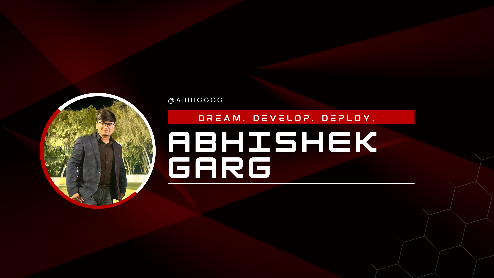

</img>

<br>

<div id="header" align="center">
  
</div>

<br>

<div id="badges" align="center">
  <a href="https://www.linkedin.com/in/abhishek-garg-003340219">
    
  </a>
  <a href="https://instagram.com/garg_abhishek_06">
    
  </a>
  <a href="mailto:abishekgarg610@gmail.com">
    
  </a>
  <br><br>
  
  
</div>

<br>

<div align="center">
  
</div>

<br>

## 🚀 About Me - Code Craftsman & Problem Solver

```javascript
const abhishek = {
    location: "Bathinda, India 🇮🇳",
    focus: "Full Stack Development | MERN Stack Enthusiast",
    currentlyLearning: ["DSA", "System Design", "Advanced React Patterns"],
    techStack: ["JavaScript", "React", "Node.js", "MongoDB", "PostgreSQL"],
    goals: "Building scalable applications that make a difference",
    funFact: "I debug with console.log() and I'm not ashamed! 😄"
};
```
* ✉️  **Reach me at**: abishekgarg610@gmail.com
* 🧠  **Currently mastering**: DSA, Full Stack Development (MERN), System Design
* 🎯  **2025 Goals**: Contributing to open source & building impactful projects
* 💡  **Philosophy**: "Code is poetry written in logic"

---

### 🛠️ Tech Arsenal & Tools

<table>
  <tr>
    <td align="center" width="96">
      
      <br>JavaScript
    </td>
    <td align="center" width="96">
      
      <br>React
    </td>
    <td align="center" width="96">
      
      <br>Node.js
    </td>
    <td align="center" width="96">
      
      <br>Express.js
    </td>
    <td align="center" width="96">
      
      <br>MongoDB
    </td>
    <td align="center" width="96">
      
      <br>PostgreSQL
    </td>
    <td align="center" width="96">
      
      <br>MySQL
    </td>
    <td align="center" width="96">
      
      <br>Python
    </td>
  </tr>
  <tr>
    <td align="center" width="96">
      
      <br>HTML5
    </td>
    <td align="center" width="96">
      
      <br>CSS3
    </td>
    <td align="center" width="96">
      
      <br>Tailwind
    </td>
    <td align="center" width="96">
      
      <br>Git
    </td>
    <td align="center" width="96">
      
      <br>Docker
    </td>
    <td align="center" width="96">
      
      <br>Linux
    </td>
    <td align="center" width="96">
      
      <br>VS Code
    </td>
    <td align="center" width="96">
      
      <br>Postman
    </td>
  </tr>
</table>

---

### 🔥 GitHub Analytics & Performance

<div align="center">
  
  
</div>

<div align="center">
  
</div>

---

### 🏆 Achievements & Recognition

<div align="center">
  
</div>

---

### 📊 Weekly Development Breakdown

```text
💻 Programming Languages & Time Spent:
JavaScript   █████████████████████████   85.2%
Python       ████████████████████        68.4%
HTML/CSS     ████████████████            52.7%
SQL          ████████████                39.8%
Shell        ████████                    25.5%
```

---

### 🌟 Current Focus & Learning Journey

- 🚀 **Mastering**: Advanced React patterns, Node.js architecture, System Design
- 🎯 **Building**: Full-stack applications with MERN stack
- 📚 **Studying**: Data Structures & Algorithms, Operating Systems, Database Management
- 🌱 **Exploring**: Cloud technologies, DevOps practices, and microservices architecture
- 💼 **Goal**: Contributing to impactful open-source projects and building scalable solutions

---

### 💡 Philosophy & Approach

> *"The best code is not just functional, but elegant, maintainable, and tells a story."*

- 🎨 **Clean Code Advocate**: Writing readable, maintainable code
- 🔍 **Problem Solver**: Breaking down complex problems into manageable solutions
- 🚀 **Continuous Learner**: Always staying updated with latest technologies
- 🤝 **Collaborative**: Believing in the power of teamwork and knowledge sharing


### 🔥 Cool Stuff 

<div align="center">
  
  <!-- Random Dev Quote -->
  
  
  <br><br>
  
  <!-- Joke API -->
  
  
  <br><br>
  
  <!-- Dynamic Badges -->
  
  
  
  


<div align="center">
  
</div>

---

<div align="center">
  <h3>🚀 Let's Connect & Build Something Amazing Together!</h3>
</div>
